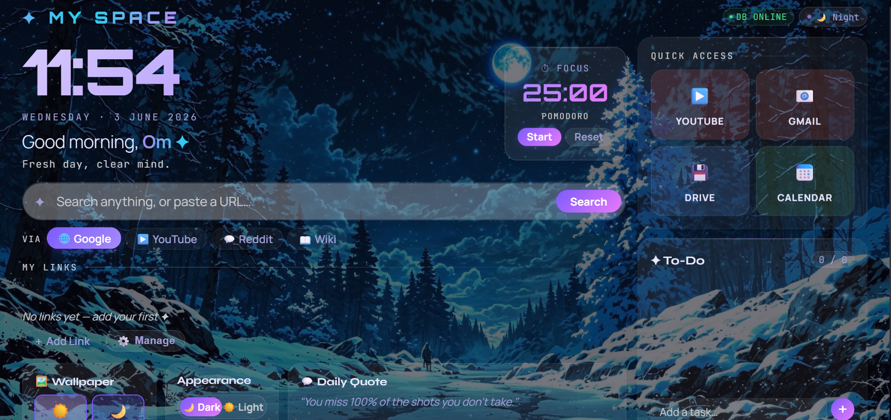

# ✦ My Space

A personal browser start-page with a sci-fi dark aesthetic, built on **Node.js + Express**. Features a gated auth system, persistent backend storage, and a fully customisable dashboard — all running locally on your machine.



---

## Features

**Auth System**
- Login and Sign Up via username & password
- Secret key gate — only people with the key can register
- Session stored in `localStorage`; unauthenticated users are redirected to the login page
- Face Recognition button stub — ready for you to wire up your own implementation

**Dashboard**
- Live clock with date, time-of-day greeting, and rotating motivational sub-greetings
- Pomodoro focus timer with start, pause, and reset controls + live progress percentage
- Search bar supporting Google, YouTube, Reddit, and Wikipedia — also opens direct URLs
- Custom links grid — add, emoji-pick, and delete your own shortcuts, persisted to the backend
- To-Do list with add, toggle complete, and delete, synced to the backend
- Quick Access panel with one-click links to YouTube, Gmail, Drive, and Calendar
- Daily rotating quote with a refresh button
- Day / Night wallpaper slots — upload your own images, auto-switches by time of day with parallax mouse effect
- Dark / Light theme toggle, persisted to the backend
- DB status badge — shows ONLINE, OFFLINE MODE, or CONNECTING live

**Backend**
- Express server with a flat JSON file database (`data/user_credentials.json`)
- Full REST API for settings, links, todos, and wallpapers
- Offline fallback — all features degrade gracefully to `localStorage` if the server is unreachable
- Wallpapers stored as base64 data-URLs in `data/wallpapers/`

---

## Project Structure

```
my-space/
├── public/
│   ├── auth.html        # Login / Sign Up page
│   ├── index.html       # Main dashboard
│   ├── script.js        # All dashboard logic
│   └── style.css        # Full styling
├── data/
│   ├── user_credentials.json   # DB — users, links, todos, settings
│   └── wallpapers/
│       ├── day.txt      # Day wallpaper (base64)
│       └── night.txt    # Night wallpaper (base64)
├── Images/              # Quick Access icon images
├── server.js            # Express server + REST API
├── package.json
└── package-lock.json
```

---

## Getting Started

### Prerequisites
- [Node.js](https://nodejs.org/) v16 or higher

### Installation

```bash
# 1. Clone the repo
git clone https://github.com/your-username/my-space.git
cd my-space

# 2. Install dependencies
npm install

# 3. Start the server
npm start
```

Then open **http://localhost:5000** in your browser.

For development with auto-restart on file changes:
```bash
npm run dev
```

---

## Configuration

### Changing the Secret Key

Open `server.js` and update this line near the top:

```js
const SecKey = "Indra Arrow";  // ← change to your own secret key
```

Anyone who wants to register an account must enter this key on the Sign Up page. Keep it private — share it only with people you want to give access.

### Changing the Port

The server defaults to port `5000`. Override it with an environment variable:

```bash
PORT=3000 npm start
```

---

## API Reference

| Method | Endpoint | Description |
|--------|----------|-------------|
| `POST` | `/api/register` | Register a new user (requires `secreteKey`) |
| `POST` | `/api/login` | Login with username & password |
| `GET` | `/api/ping` | Health check |
| `GET/POST` | `/api/settings` | Get or update theme settings |
| `GET` | `/api/links` | Get all saved links |
| `POST` | `/api/links` | Add a new link |
| `DELETE` | `/api/links/:id` | Delete a link |
| `GET` | `/api/todos` | Get all todos |
| `POST` | `/api/todos` | Add a new todo |
| `POST` | `/api/todos/:id/toggle` | Toggle todo done/undone |
| `DELETE` | `/api/todos/:id` | Delete a todo |
| `GET` | `/api/wallpapers` | Get both wallpaper slots |
| `GET` | `/api/wallpapers/:slot` | Get day or night wallpaper |
| `POST` | `/api/wallpapers/:slot` | Upload a wallpaper (base64 dataURL) |
| `DELETE` | `/api/wallpapers/:slot` | Clear a single wallpaper slot |
| `DELETE` | `/api/wallpapers` | Clear both wallpaper slots |

---

## How Auth Works

```
User visits localhost:5000
        ↓
Express serves auth.html (index: false disables auto index.html)
        ↓
User logs in → localStorage.setItem('loggedIn', 'true')
        ↓
Redirected to /index.html
        ↓
index.html checks localStorage on load → if not logged in, back to auth
```

Credentials are stored in `data/user_credentials.json` under a `users` key. Passwords are Base64-encoded. This is suitable for personal/local use — for a public deployment, replace with `bcrypt` hashing.

---

## Tech Stack

| Layer | Technology |
|-------|-----------|
| Runtime | Node.js |
| Server | Express 4 |
| Database | JSON flat file |
| Frontend | Vanilla HTML / CSS / JS |
| Fonts | Orbitron, JetBrains Mono, Manrope, Syne (Google Fonts) |

---

## Roadmap / Ideas

- [ ] Replace Base64 password encoding with `bcrypt` hashing
- [ ] Face recognition login (button stub in `auth.html`)
- [ ] Multi-user support with per-user data isolation
- [ ] Draggable / reorderable links grid
- [ ] Custom Pomodoro timer durations
- [ ] Notes or journal widget

---

## License

This project is for personal use. Feel free to fork and customise it for yourself.

---

<p align="center">Built by Om ✦</p>
